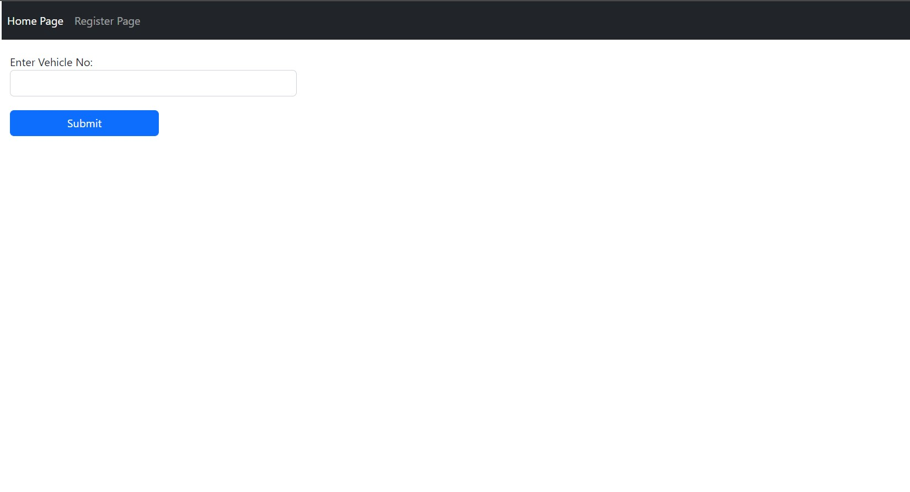
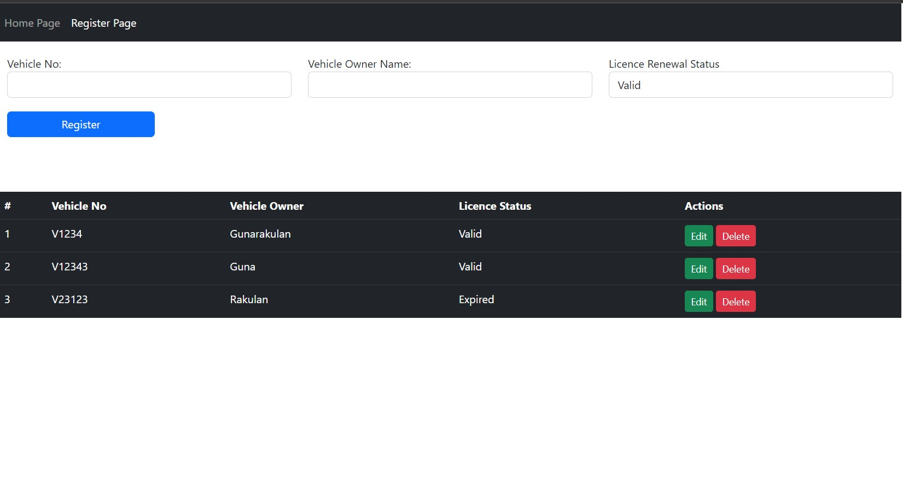
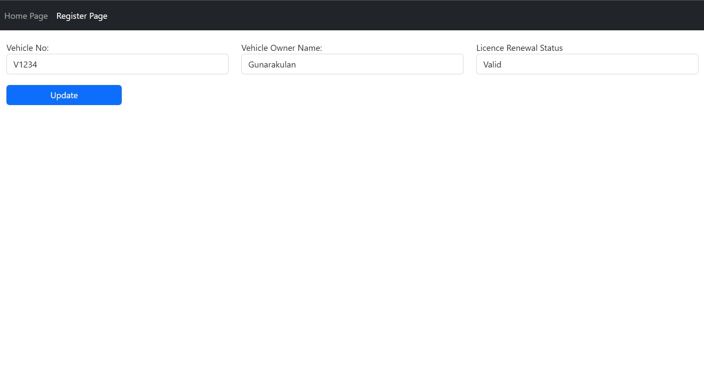
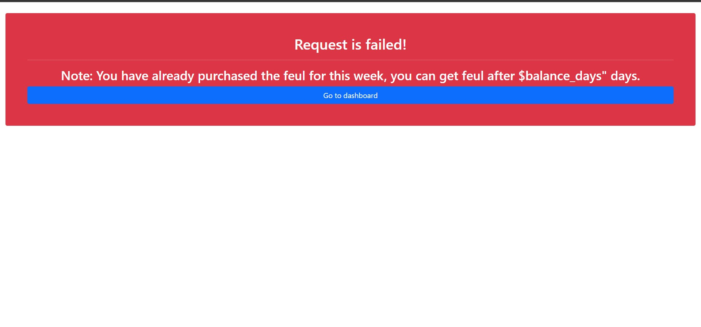

# FUEL MANAGEMENT SYSTEM

## Introduction

It is a simple fuel management system prototype for Sri Lankan's fuel shortage issue, it was built for an educational purpose to train trainees. It has the basic CURD functions. The main idea of this simple prototype is to enter the vehicle number and check whether they are capable of receiving fuel. This system is programmed to allow people receive fuel weekly wise, a vehicle owner is unable to get fuel more than 1 time.

**Acknowledgement:** It is not a complete production system, it cannot be used for production it has so many bugs and fixes.


## Technology and Frameworks

- PHP 7
- MySQL

## Directory Structure

```
├── 0-references       # Contains docs/references of the project.
├── 1-database         # Contains database of the system.
├── 2-source           # Contains project source code.    
├── README.md          # Readme Document
└── LICENCE             # License (Apache 2.0 license)

```

## Configuration & Setup

- Setup the database that is found under the  pyttsx3 1-database folder.

  ```
  fuel-management-system/1-database/fuel-management-system-database.sql
  ```

- Deploy the project, the project source is found under the 2-souce folder.

  ```
    fuel-management-system/2-source
  ```


## Demo

### Dashboard Page

This is the home page of the system, As it is already mentioned, it is just a prototype project for training purpose. It does not have any login panel.



### Register Page




#### Features

- Vehicle data editing function
- Vehicle data deletion function

### Edit Page



### Testing


### Success page


### Failed page




# CONTACT

### Website: 

[](https://www.gunarakulan.info)

### Social Media:

[](https://www.linkedin.com/in/gunarakulangunaretnam)
[](https://www.facebook.com/gunarakulangunaretnam)
[](https://wa.me/94740001141?text=WhatsApp%3A%20%2B9740001141)
[](https://www.instagram.com/gunarakulangunaretnam)
[](https://x.com/gunarakulangr)
[](https://www.kaggle.com/gunarakulangr)
[](https://www.tiktok.com/@gunarakulangunaretnam)
[](https://www.youtube.com/channel/UCjMOdgHFAjAdBKiqV8y2Tww)
